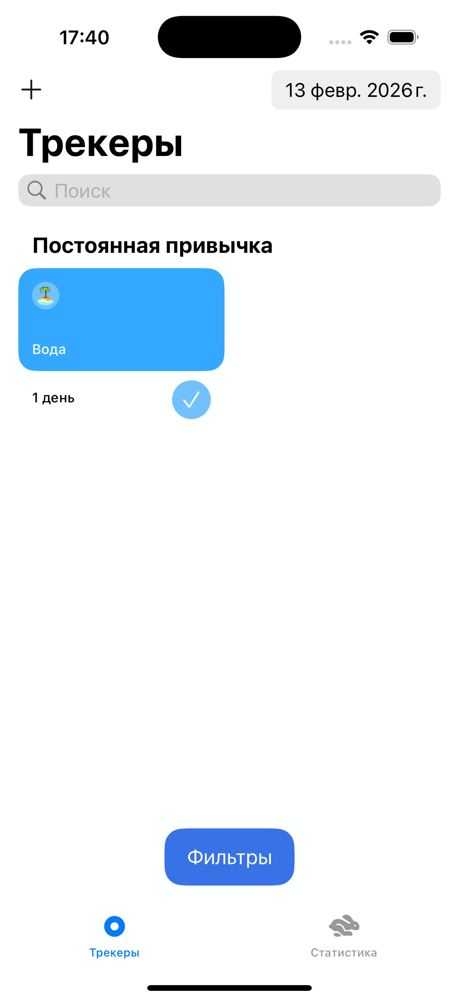
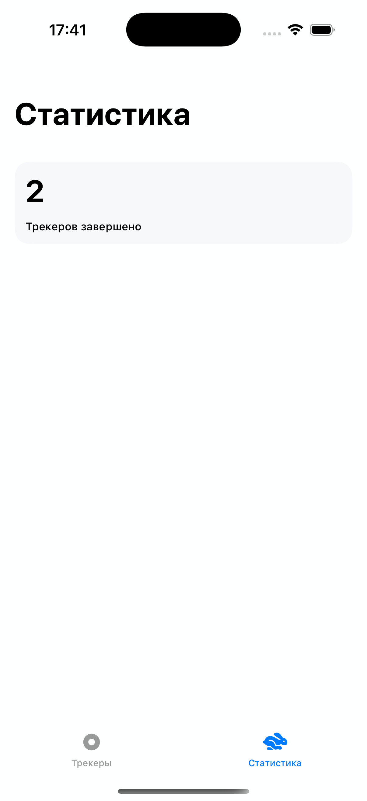
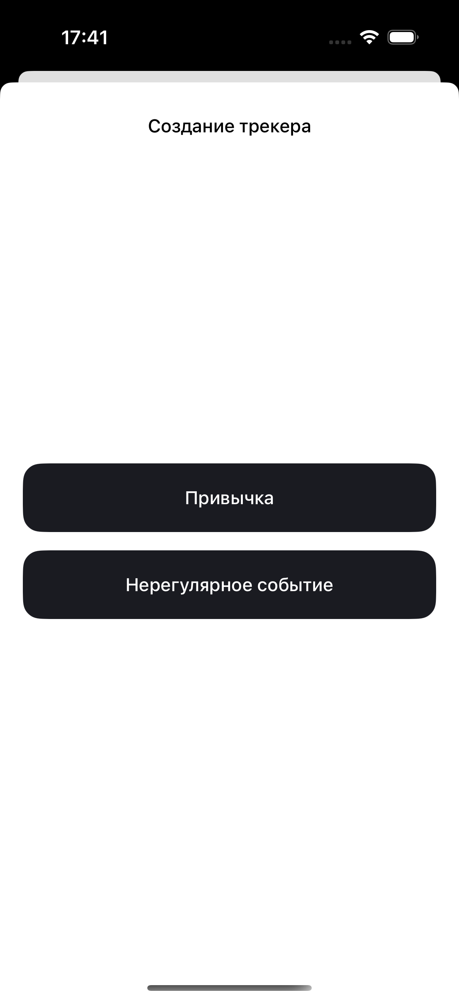
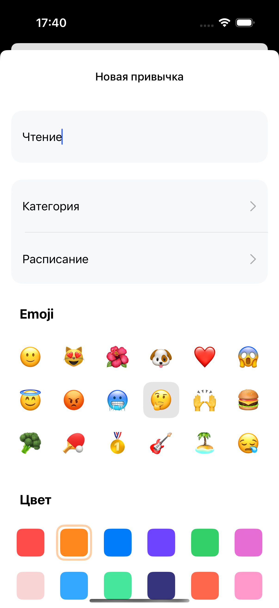

# 📊 Tracker
Tracker is an iOS application that helps users build habits and track one-time activities.
Users can create customizable trackers with a name, emoji, color, and category. The app allows filtering trackers by completion status, viewing activity history in a calendar, and tracking overall progress statistics.

## ✨ Features
- 📝 Create habits with title, emoji, color, and category
- 📂 Create and manage custom categories
- 🔁 Habits that appear considering set schedule
- ⏳ One-time activities visible until completed
- 📅 Calendar to view completed trackers by date
- 🔎 Filter trackers by completed / not completed
- 📈 Statistics screen with total completed trackers
- 🧪 Snapshot Tests for UI validation
- 📊 Analytics integration with AppMetrica

## 🛠 Tech Stack
**Language:** Swift 
**UI:** UIKit 
**Persistence:** Core Data 
**Analytics:** AppMetrica 
**Testing:** Snapshot Tests 
**Design:** Figma 

## 📱 Screenshots

  
  

  
  

## 🎨 Design
The UI/UX design was created in Figma:
👉 [Open Figma Prototype](https://www.figma.com/design/owAO4CAPTJdpM1BZU5JHv7/Tracker?node-id=37878-12845&t=h3K7tdFvkk5rXm2J-1)

## 🚀 Installation
1. Clone the repository
2. Open the project in Xcode
3. Run the project on a simulator or device (iOS 13.4+)

## 📫 Contact
E-mail: alnepryakhin@gmail.com 
Telegram: https://t.me/nizyashka 
GitHub: https://github.com/nizyashka 
